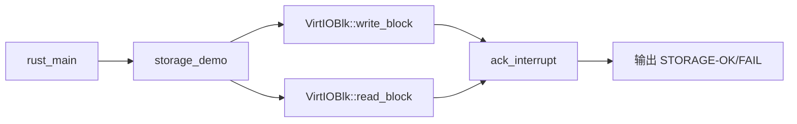

# tg-rcore-tutorial-ch1-storage


`tg-rcore-tutorial-ch1-storage` 在 `tg-rcore-tutorial-ch1` 基础上扩展了最小磁盘读写能力。内核在 S-Mode 直接驱动 VirtIO 块设备，完成一个块写入、读回校验、再恢复原块数据。

## 省流（先跑起来）

```bash
cd tg-rcore-tutorial-ch1-storage
bash test.sh
```

看到 `STORAGE-OK` 即表示磁盘读写闭环通过。

## 实验目标

本实验实现了一个**最小化的 VirtIO 块设备驱动**，在裸机环境下完成磁盘扇区的读写验证。你将：

1. **理解 VirtIO 协议**：掌握半虚拟化 I/O 设备的基本工作原理
2. **实践 MMIO 编程**：直接操作设备寄存器与硬件通信
3. **实现 DMA 管理**：在无标准库环境下为设备分配物理内存
4. **处理设备中断**：学习中断状态读取与应答机制
5. **验证数据一致性**：构建"写入→读回→校验→恢复"的完整闭环

## 关键设计

- 设备：QEMU `virtio-blk-device`（MMIO `0x10001000`）
- 操作：写入块 `BLOCK_ID=8`，读回比较，再写回备份
- 中断机制：读写后读取并应答 VirtIO MMIO `interrupt status/ack`
- 启动：`-bios none`，沿用 ch1 的最小启动结构

## 调用链



## 运行

```bash
cd tg-rcore-tutorial-ch1-storage
if [ ! -f fs.img ]; then dd if=/dev/zero of=fs.img bs=1M count=16 status=none; fi
cargo run
```

预期输出包含：

```text
ch1-storage: start
irq_after_write=...
irq_after_read=...
STORAGE-OK
```

## 源码阅读导航

| 阅读顺序 | 位置 | 重点问题 |
|---|---|---|
| 1 | `src/main.rs::rust_main` | 最小启动后如何组织验证流程？ |
| 2 | `src/main.rs::storage_demo` | 为什么要先备份块、再恢复块？ |
| 3 | `src/main.rs::ack_interrupt` | 中断状态如何读取与应答？ |
| 4 | `src/main.rs::VirtioHal` | DMA 分配在 no_std 下怎么做？ |

## DoD 验收标准

- [ ] `cargo run` 输出 `STORAGE-OK`
- [ ] 输出中包含 `irq_after_write` 与 `irq_after_read`
- [ ] 测试块读回数据与写入数据一致
- [ ] 完成写回备份，镜像不被长期污染
- [ ] `bash test.sh` 自动化验证通过

## 常见问题

- `cargo run` 报磁盘参数错误：检查 `.cargo/config.toml` 是否包含 `-drive` 与 `virtio-blk-device`
- 输出 `STORAGE-FAIL`：优先确认 `fs.img` 可读写，或将 `BLOCK_ID` 改为其它非关键扇区重试
- 无中断状态输出：确认 QEMU 设备类型为 `virtio-mmio`，并检查 MMIO 基址是否为 `0x10001000`

## 文件结构

```text
tg-rcore-tutorial-ch1-storage/
├── Cargo.toml                 # Rust 项目配置
├── rust-toolchain.toml        # 工具链版本锁定
├── build.rs                   # 构建脚本（生成链接脚本）
├── .cargo/
│   └── config.toml            # Cargo 配置（目标平台、QEMU 参数）
├── fs.img                     # 虚拟磁盘镜像
├── test.sh                    # 测试脚本
└── src/
    └── main.rs                # 内核入口（virtio-blk 驱动与测试逻辑）
```

> **说明**：本实验代码已实现完整功能，主要作为**阅读学习**和**运行验证**使用。建议先运行观察输出，再阅读源码理解实现原理。

## 依赖说明

本项目依赖以下 crate：

| 依赖 | 版本 | 用途 |
|------|------|------|
| `riscv` | 0.10.1 | RISC-V 架构相关寄存器、CSR 操作和汇编指令封装 |
| `spin` | 0.9 | 自旋锁实现，用于无标准库环境下的同步原语 |
| `virtio-drivers` | 0.1.0 | VirtIO 设备驱动库，提供 virtio-blk 块设备驱动支持 |
| `tg-rcore-tutorial-sbi` | 0.4.8 | SBI（Supervisor Binary Interface）实现，提供 M-mode 运行时支持 |

## 原理讲解

### 1. VirtIO 架构概述

VirtIO 是半虚拟化（paravirtualization）的 I/O 标准，由 QEMU/KVM 等虚拟化平台广泛支持。相比完全模拟真实硬件（如 IDE/SATA），VirtIO 通过前后端协作减少了 VM-Exit 次数，显著提升 I/O 性能。

**核心组件：**
- **Device（设备）**：位于 Guest OS 内核中，通过 MMIO/PCI 与 Host 通信
- **Driver（驱动）**：管理 Virtqueue（虚拟队列），提交 I/O 请求
- **Virtqueue**：环形缓冲区，用于前后端传递请求和完成通知

### 2. VirtIO-BLK 工作流程*（Text显示需要一定宽度）

```
┌─────────────────────────────────────────────────────────────────┐
│                        Guest OS (S-mode)                        │
│  ┌─────────────┐    ┌─────────────┐    ┌─────────────────────┐ │
│  │  用户请求   │───▶│ VirtIO 驱动 │───▶│   Virtqueue (环)    │ │
│  │  读写块设备 │    │             │    │  [desc][avail][used]│ │
│  └─────────────┘    └─────────────┘    └─────────────────────┘ │
│                           │                    │                │
│                           ▼                    ▼                │
│                    ┌─────────────┐    ┌─────────────┐          │
│                    │ MMIO 写通知 │───▶│   Host 处理  │          │
│                    │  (通知后端) │    │  (QEMU/KVM)  │          │
│                    └─────────────┘    └─────────────┘          │
└─────────────────────────────────────────────────────────────────┘
```

**本实验的具体流程：**
1. **初始化**：通过 MMIO 探测 VirtIO 设备，协商特性，配置 Virtqueue
2. **提交请求**：将读写请求写入 Virtqueue 的描述符表
3. **通知后端**：写 MMIO 的 Queue Notify 寄存器，触发 Host 处理
4. **等待完成**：轮询或接收中断，检查 Used Ring 中的完成标记
5. **中断应答**：读取中断状态寄存器并回写应答，清除中断

### 3. MMIO 寄存器布局

QEMU `virt` 机器将 VirtIO-BLK 设备映射到物理地址 `0x10001000`，关键寄存器如下：

| 偏移 | 寄存器 | 说明 |
|------|--------|------|
| 0x00 | Magic | 应为 0x74726976 ("virt") |
| 0x04 | Version | VirtIO 版本号 |
| 0x08 | Device ID | 设备类型（2 = 块设备）|
| 0x0C | Vendor ID | 供应商 ID |
| 0x10 | Host Features | 设备支持的特性位 |
| 0x34 | Queue Sel | 选择要操作的队列 |
| 0x38 | Queue Num Max | 队列最大描述符数 |
| 0x44 | Queue Ready | 队列就绪状态 |
| 0x60 | Interrupt Status | 中断状态（读取）|
| 0x64 | Interrupt ACK | 中断应答（写入）|

### 4. DMA 与内存管理

VirtIO 要求驱动为 Virtqueue 分配物理连续的 DMA 内存。在 `no_std` 环境下，本实验采用以下策略：

```rust
// 1. 预分配静态 DMA 区域（4KB 对齐）
#[repr(C, align(4096))]
struct DmaArea([u8; PAGE_SIZE * DMA_PAGES]);
static mut DMA_AREA: DmaArea = DmaArea([0u8; PAGE_SIZE * DMA_PAGES]);

// 2. 实现 Hal trait 提供 DMA 分配
impl Hal for VirtioHal {
    fn dma_alloc(pages: usize) -> usize {
        // bump 分配，返回物理地址
        let start = DMA_NEXT.fetch_add(pages, Ordering::SeqCst);
        base + start * PAGE_SIZE
    }
    // ...
}
```

**关键点：**
- 使用 `#[repr(C, align(4096))]` 确保页对齐
- 采用恒等映射（Identity Mapping）：虚拟地址 = 物理地址
- Bump Allocator 简单高效，适合只增不减的场景

### 5. 中断处理机制

VirtIO 设备通过 MMIO 中断通知驱动请求已完成。本实验的中断处理流程：

```rust
fn ack_interrupt() -> u32 {
    // 1. 读取中断状态寄存器
    let status = unsafe { (IRQ_STATUS as *const u32).read_volatile() };
    // 2. 非零表示有中断，回写应答清除
    if status != 0 {
        unsafe { (IRQ_ACK as *mut u32).write_volatile(status) };
    }
    status
}
```

**中断类型：**
- **Bit 0**：Virtqueue 中断（I/O 完成）
- **Bit 1**：配置变更中断（设备配置被修改）

### 6. 数据一致性保证

本实验采用"写入-读回-校验-恢复"的闭环验证：

```rust
fn storage_demo() -> bool {
    // 1. 备份原扇区（避免污染镜像）
    blk.read_block(BLOCK_ID, &mut backup)?;
    
    // 2. 写入测试数据
    blk.write_block(BLOCK_ID, &write_buf)?;
    let irq_after_write = ack_interrupt();
    
    // 3. 读回并校验
    blk.read_block(BLOCK_ID, &mut read_buf)?;
    let irq_after_read = ack_interrupt();
    
    // 4. 恢复原数据
    blk.write_block(BLOCK_ID, &backup)?;
    
    // 5. 返回校验结果
    read_buf == write_buf
}
```

**为什么需要恢复？**
- `fs.img` 是测试用的磁盘镜像，多次运行实验不应累积污染
- 备份-恢复机制确保每次实验都从干净状态开始

### 7. 你能学到什么

完成本实验后，你将掌握：

1. **VirtIO 协议基础**：理解半虚拟化 I/O 的工作原理
2. **MMIO 编程**：直接操作设备寄存器进行设备初始化与控制
3. **DMA 内存管理**：在无标准库环境下为设备分配物理内存
4. **中断处理**：读取和应答设备中断，实现前后端同步
5. **块设备驱动**：理解扇区读写、数据校验等存储基础概念
6. **裸机调试技巧**：通过串口输出观察内核运行状态

### 8. 进阶思考

- **Q**：为什么 VirtIO 比模拟真实硬件（如 IDE）性能更好？  
  **A**：VirtIO 减少了 VM-Exit 次数，批量处理 I/O 请求，且不需要模拟复杂的硬件时序。

- **Q**：如果去掉 `ack_interrupt()` 会怎样？  
  **A**：设备中断状态不会被清除，可能导致中断风暴或后续 I/O 无法触发中断。

- **Q**：DMA 区域为什么要物理连续？  
  **A**：设备通过物理地址直接访问内存，不经过 MMU 翻译，无法处理分散的物理页。

## 动手实践 Tips

想进一步探索？试试以下个性化操作：

### 1. 修改测试扇区
在 `src/main.rs` 中修改 `BLOCK_ID` 常量，测试不同扇区的读写：
```rust
const BLOCK_ID: usize = 16;  // 改为其他扇区号（如 0, 1, 100 等）
```

### 2. 修改测试数据
修改写入的 payload，观察读回结果：
```rust
let payload = b"Hello, VirtIO!";  // 自定义你的测试字符串
```

### 3. 禁用中断应答观察现象
注释掉 `ack_interrupt()` 调用，观察中断状态的变化：
```rust
// let irq_after_write = ack_interrupt();
// let irq_after_read = ack_interrupt();
```

### 4. 扩大 DMA 区域
修改 `DMA_PAGES` 常量，为 Virtqueue 分配更多内存：
```rust
const DMA_PAGES: usize = 64;  // 从 32 页增加到 64 页
```

### 5. 添加更多调试输出
在关键步骤添加 `println!`，观察执行流程：
```rust
println!("正在备份扇区 {}...", BLOCK_ID);
println!("写入数据: {:?}", &write_buf[..20]);
```

### 6. 尝试连续读写多个扇区
扩展 `storage_demo()` 函数，实现多扇区读写循环：
```rust
for block_id in 8..12 {
    // 对每个扇区执行读写测试
}
```

### 7. 使用 hexdump 查看磁盘镜像
在宿主机上查看 `fs.img` 的原始内容：
```bash
xxd fs.img | head -100  # 查看前 100 行十六进制输出
```

### 8. 修改磁盘镜像大小
创建更大的磁盘镜像进行测试：
```bash
dd if=/dev/zero of=fs.img bs=1M count=64  # 创建 64MB 镜像
```

## License

GPL-3.0

